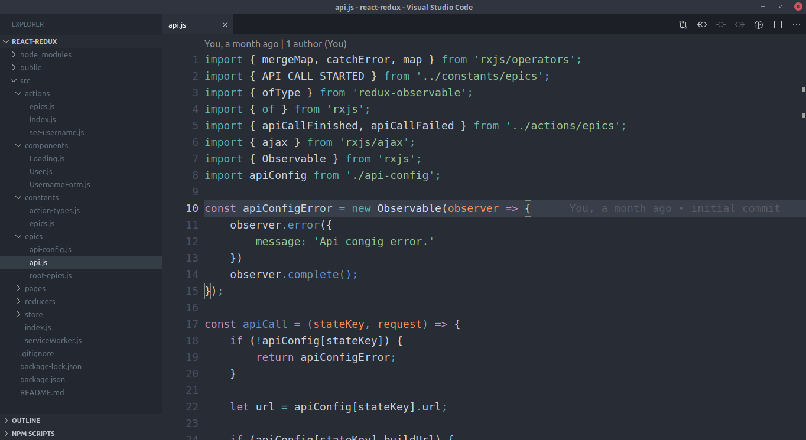
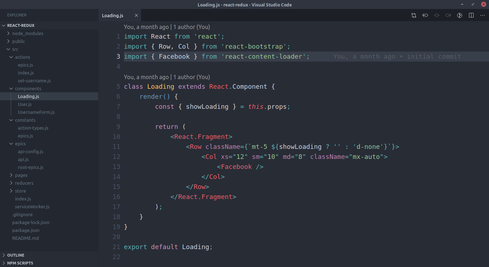

# Ace Dark

[](https://marketplace.visualstudio.com/items?itemName=acestojanoski.ace-dark)
[](https://marketplace.visualstudio.com/items?itemName=acestojanoski.ace-dark)  

**Ace Dark** is a color theme for VS Code based on [Oceanic Next](https://github.com/mhartington/vscode-oceanicnext) and [Subliminal](https://github.com/gaearon/subliminal). Please see the [Credits](#credits) section.

## Content
*   [Screenshots](#Screenshots)
*   [settings.json](#settings.json)
*   [Credits](#Credits)
*   [Changelog](./CHANGELOG.md)
*   [Licence](./LICENSE)

## Screenshots






## settings.json

Add this configuration to you VS Code `settings.json` file:
```
{
    ...

    "workbench.colorTheme": "Ace Dark",
    "editor.fontSize": 16,
    "editor.folding": false,
    "editor.hideCursorInOverviewRuler": true,
    "editor.lineHeight": 26,
    "editor.lineNumbers": "on",
    "editor.matchBrackets": true,
    "editor.minimap.enabled": false,
    "editor.occurrencesHighlight": false,
    "editor.overviewRulerBorder": false,
    "editor.renderIndentGuides": false,
    "explorer.openEditors.visible": 0,
    "window.zoomLevel": 0,
    "workbench.activityBar.visible": false,
    "workbench.iconTheme": null,
    "workbench.editor.showIcons": false,
    "workbench.statusBar.visible": false,
    "breadcrumbs.enabled": false,
    "window.menuBarVisibility": "toggle"

    ...
}
```

## Credits

I forked [Oceanic Next](https://github.com/mhartington/vscode-oceanicnext) and [Subliminal](https://github.com/gaearon/subliminal) which are based on other themes, and combined them to create a theme to fit my own needs. All credits goes to [Dan Abramov](https://github.com/gaearon) and [Mike Hartington](https://github.com/mhartington) for creating these beautiful themes.

## [CHANGELOG](./CHANGELOG.md)

## Licence
[MIT](./LICENSE)


### **Enjoy!**
